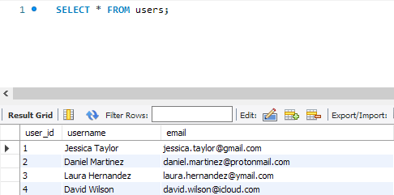
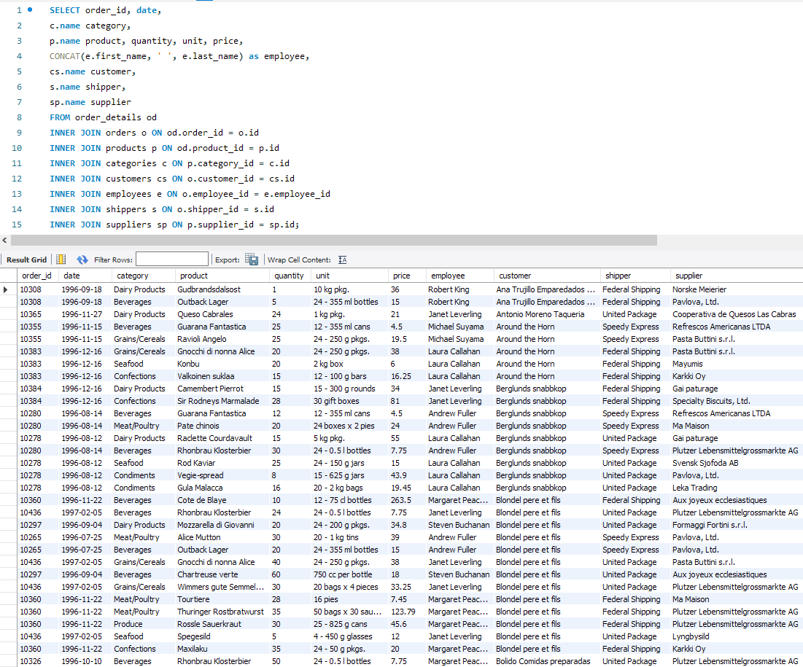

# Relational Databases DML and DDL commands HW-04

## P1

```sql
CREATE SCHEMA LibraryManagement;

USE LibraryManagement;

CREATE TABLE authors (
    author_id INT PRIMARY KEY AUTO_INCREMENT,
    author_name VARCHAR(255)
);

CREATE TABLE genres (
    genre_id INT PRIMARY KEY AUTO_INCREMENT,
    genre_name VARCHAR(255)
);

CREATE TABLE books (
    book_id INT PRIMARY KEY AUTO_INCREMENT,
    title VARCHAR(255),
    publication_year YEAR,
    author_id INT,
    genre_id INT,
    FOREIGN KEY (author_id) REFERENCES authors (author_id),
    FOREIGN KEY (genre_id) REFERENCES genres (genre_id)
);

CREATE TABLE users (
    user_id INT PRIMARY KEY AUTO_INCREMENT,
    username VARCHAR(255),
    email VARCHAR(255)
);

CREATE TABLE borrowed_books (
    borrow_id INT PRIMARY KEY AUTO_INCREMENT,
    book_id INT,
    user_id INT,
    borrow_date DATE,
    return_date DATE,
    FOREIGN KEY (book_id) REFERENCES books (book_id),
    FOREIGN KEY (user_id) REFERENCES users (user_id)
);
```


## P2

```sql
USE LibraryManagement;

INSERT INTO authors (author_name)
VALUES
    ('J.K. Rowling'),
    ('George Orwell'),
    ('J.R.R. Tolkien'),
    ('Jane Austen');

INSERT INTO genres (genre_name)
VALUES
    ('Fantasy'),
    ('Dystopian'),
    ('Memoir'),
    ('Romance');

INSERT INTO books (title, publication_year, author_id, genre_id)
VALUES
    ('Harry Potter and the Sorcerer\'s Stone', 1997, 1, 1),
    ('Animal Farm', 1945, 2, 2),    
    ('The Fellowship of the Ring', 1954, 3, 1),
    ('Pride and Prejudice', 1913, 4, 4),
    ('Harry Potter and the Chamber of Secrets', 1998, 1, 1),
    ('Homage to Catalonia', 1938, 2, 3);

INSERT INTO users (username, email)
VALUES
    ('Jessica Taylor', 'jessica.taylor@gmail.com'),
    ('Daniel Martinez', 'daniel.martinez@protonmail.com'),
    ('Laura Hernandez', 'laura.hernandez@ymail.com'),
    ('David Wilson', 'david.wilson@icloud.com');

INSERT INTO borrowed_books (book_id, user_id, borrow_date, return_date)
VALUES
    (4, 2, '2024-08-08', '2024-09-11'),
    (3, 1, '2024-08-15', NULL),
    (2, 3, '2024-09-10', '2024-09-21'),
    (1, 4, '2024-10-05', NULL);
```





## P3

```sql
USE mydb;

SELECT order_id, date, 
c.name category, 
p.name product, quantity, unit, price, 
CONCAT(e.first_name, ' ', e.last_name) as employee, 
cs.name customer, 
s.name shipper, 
sp.name supplier  
FROM order_details od 
INNER JOIN orders o ON od.order_id = o.id 
INNER JOIN products p ON od.product_id = p.id 
INNER JOIN categories c ON p.category_id = c.id 
INNER JOIN customers cs ON o.customer_id = cs.id 
INNER JOIN employees e ON o.employee_id = e.employee_id 
INNER JOIN shippers s ON o.shipper_id = s.id 
INNER JOIN suppliers sp ON p.supplier_id = sp.id;
```




## P4_1

```sql
USE mydb;

SELECT count(*) as orders_count  
FROM order_details od 
INNER JOIN orders o ON od.order_id = o.id 
INNER JOIN products p ON od.product_id = p.id 
INNER JOIN categories c ON p.category_id = c.id 
INNER JOIN customers cs ON o.customer_id = cs.id 
INNER JOIN employees e ON o.employee_id = e.employee_id 
INNER JOIN shippers s ON o.shipper_id = s.id 
INNER JOIN suppliers sp ON p.supplier_id = sp.id;
```


## P4_2

```sql
USE mydb;

SELECT count(*) as orders_count  
FROM order_details od 
INNER JOIN orders o ON od.order_id = o.id 
INNER JOIN products p ON od.product_id = p.id 
INNER JOIN categories c ON p.category_id = c.id 
RIGHT JOIN customers cs ON o.customer_id = cs.id 
LEFT JOIN employees e ON o.employee_id = e.employee_id 
LEFT JOIN shippers s ON o.shipper_id = s.id 
LEFT JOIN suppliers sp ON p.supplier_id = sp.id;

-- при використанні RIGHT/LEFT JOIN Рядків стало більше, тому що RIGHT/LEFT JOIN включають рядки які не мають відповідностей в правій/лівій таблиці
-- у нашому випадку в таблиці customers є кілька customers, які не замовляли товар і їх немає в таблиці orders
```


## P4_3

```sql
USE mydb;

SELECT order_id, date, 
c.name category, 
p.name product, quantity, unit, price, 
e.employee_id, 
CONCAT(e.first_name, ' ', e.last_name) as employee, 
cs.name customer, 
s.name shipper, 
sp.name supplier  
FROM order_details od 
INNER JOIN orders o ON od.order_id = o.id 
INNER JOIN products p ON od.product_id = p.id 
INNER JOIN categories c ON p.category_id = c.id 
INNER JOIN customers cs ON o.customer_id = cs.id 
INNER JOIN employees e ON o.employee_id = e.employee_id 
INNER JOIN shippers s ON o.shipper_id = s.id 
INNER JOIN suppliers sp ON p.supplier_id = sp.id 
WHERE e.employee_id > 3 AND e.employee_id <= 10;

-- всього 317 Рядків
```


## P4_4

```sql
USE mydb;

SELECT c.name category, COUNT(*) count, AVG(od.quantity) quantity 
FROM order_details od 
INNER JOIN orders o ON od.order_id = o.id 
INNER JOIN products p ON od.product_id = p.id 
INNER JOIN categories c ON p.category_id = c.id 
INNER JOIN customers cs ON o.customer_id = cs.id 
INNER JOIN employees e ON o.employee_id = e.employee_id 
INNER JOIN shippers s ON o.shipper_id = s.id 
INNER JOIN suppliers sp ON p.supplier_id = sp.id 
GROUP BY c.name;
```


## P4_5

```sql
USE mydb;

SELECT c.name category, COUNT(*) count, AVG(od.quantity) quantity 
FROM order_details od 
INNER JOIN orders o ON od.order_id = o.id 
INNER JOIN products p ON od.product_id = p.id 
INNER JOIN categories c ON p.category_id = c.id 
INNER JOIN customers cs ON o.customer_id = cs.id 
INNER JOIN employees e ON o.employee_id = e.employee_id 
INNER JOIN shippers s ON o.shipper_id = s.id 
INNER JOIN suppliers sp ON p.supplier_id = sp.id 
GROUP BY c.name 
HAVING quantity > 21;
```


## P4_6

```sql
USE mydb;

SELECT c.name category, COUNT(*) count, AVG(od.quantity) quantity 
FROM order_details od 
INNER JOIN orders o ON od.order_id = o.id 
INNER JOIN products p ON od.product_id = p.id 
INNER JOIN categories c ON p.category_id = c.id 
INNER JOIN customers cs ON o.customer_id = cs.id 
INNER JOIN employees e ON o.employee_id = e.employee_id 
INNER JOIN shippers s ON o.shipper_id = s.id 
INNER JOIN suppliers sp ON p.supplier_id = sp.id 
GROUP BY c.name 
HAVING quantity > 21
ORDER BY count DESC;
```


## P4_7

```sql
USE mydb;

SELECT c.name category, COUNT(*) count, AVG(od.quantity) quantity 
FROM order_details od 
INNER JOIN orders o ON od.order_id = o.id 
INNER JOIN products p ON od.product_id = p.id 
INNER JOIN categories c ON p.category_id = c.id 
INNER JOIN customers cs ON o.customer_id = cs.id 
INNER JOIN employees e ON o.employee_id = e.employee_id 
INNER JOIN shippers s ON o.shipper_id = s.id 
INNER JOIN suppliers sp ON p.supplier_id = sp.id 
GROUP BY c.name 
HAVING quantity > 21
ORDER BY count DESC
LIMIT 4 OFFSET 1;
```


